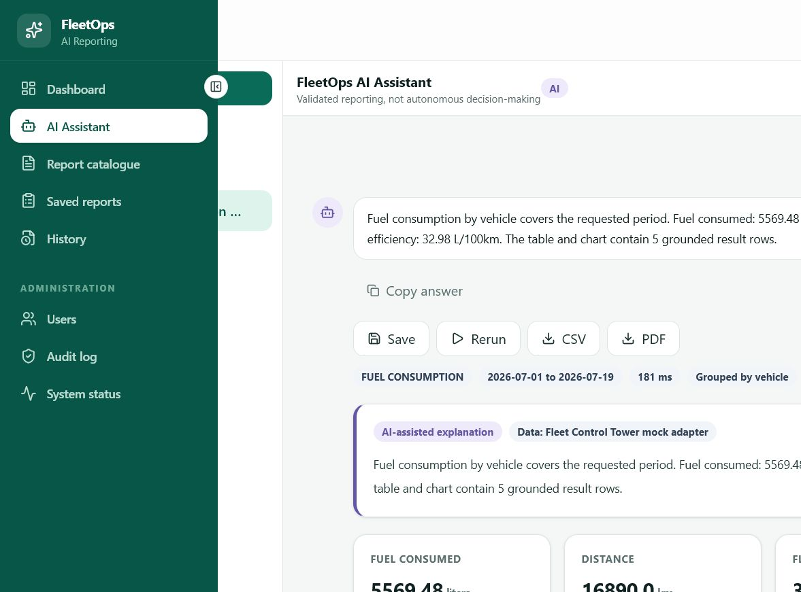
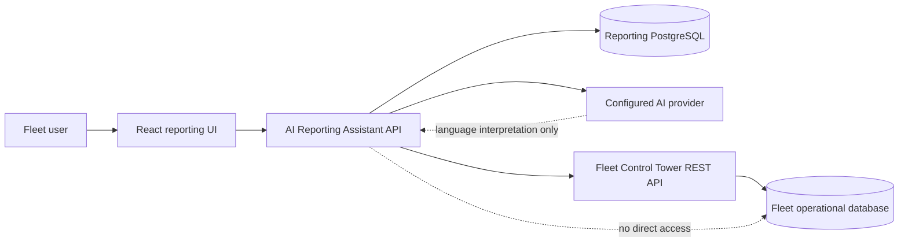
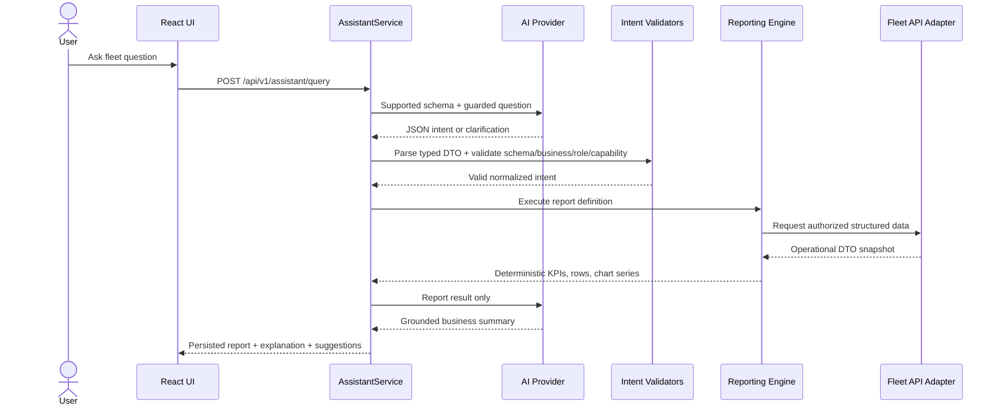
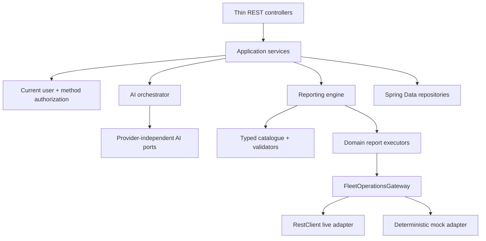
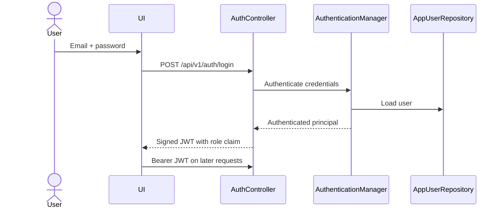
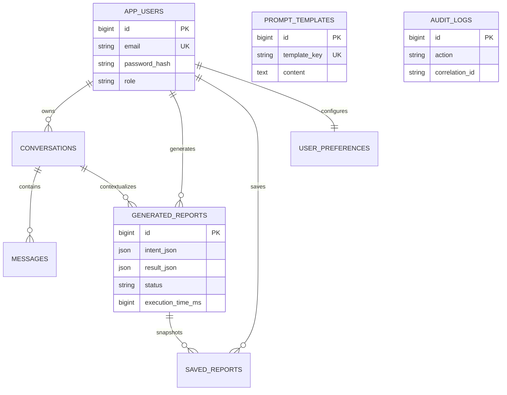

# FleetOps AI Reporting Assistant

A secure natural-language reporting product for fleet operations. It turns a user's question into a typed, validated report intent, executes deterministic calculations against an authorized Fleet Control Tower integration, and uses AI only to interpret language and explain grounded results.

This is the second application in the **FleetOps Suite** and a portfolio project demonstrating Spring Boot, React, security, AI orchestration, integration design, testing, and Docker.

> **Important:** the AI never receives database credentials, generates SQL, or queries PostgreSQL. Fleet Control Tower remains the operational source of truth.



## Business problem

Fleet managers often need answers that span vehicles, drivers, fuel, maintenance, trips, costs, and anomalies. Static dashboards cannot anticipate every question, while unrestricted text-to-SQL creates unacceptable security and correctness risks.

The Reporting Assistant provides a controlled middle ground:

- natural-language questions for a low-friction user experience;
- a strict report catalogue instead of arbitrary queries;
- deterministic backend calculations for reproducible answers;
- concise AI explanations grounded only in supplied report data;
- history, saved reports, charts, CSV/PDF export, and an audit trail.

## Key features

- 18 typed operational report definitions
- AI providers for OpenAI, Azure OpenAI, Ollama, and a deterministic local mock
- strict parsing, Bean Validation, capability checks, authorization, and prompt-injection guardrails
- live Fleet Control Tower REST integration with token or technical-user authentication
- realistic mock Fleet adapter for an independent product demonstration
- stateless JWT security with five application roles
- conversation history, report snapshots, saved reports, favorites, pins, duplication, and reruns
- branded CSV and PDF exports with authorization and safe filenames
- responsive React interface, dark mode, accessible forms, loading/error/empty states, and route-level code splitting
- PostgreSQL migrations, health indicators, correlation IDs, audit logging, Docker, Testcontainers, and CI

## System context



## Safe AI request flow



This design makes AI output testable and prevents prompt text from becoming executable data access instructions.

## Backend architecture



The project uses Spring `RestClient` because Fleet integration is synchronous request/response work and the existing application is servlet-based. WebClient would introduce reactive complexity without a business benefit; OpenFeign would add another abstraction and dependency for a single integration facade.

### Package responsibilities

| Package | Responsibility |
|---|---|
| `controller`, `dto`, `mapper` | HTTP boundary and API contracts |
| `service` | use-case orchestration and transactions |
| `report.model`, `report.validator` | typed intent and policy validation |
| `report.engine`, `report.executor` | deterministic report calculations |
| `ai.provider`, `ai.prompt`, `ai.parser` | isolated AI concerns and guardrails |
| `integration.fleet` | Fleet Control Tower anti-corruption layer |
| `entity`, `repository` | application-owned persistence only |
| `security`, `exception`, `audit`, `export` | cross-cutting production concerns |

## Authentication flow



Passwords use BCrypt. JWT signing material is mandatory environment configuration. HTTP security and `@PreAuthorize` enforce permissions independently of frontend route guards.

## Reporting database



No vehicle, driver, fuel, maintenance, trip, or anomaly table is duplicated. Stored report results are immutable point-in-time presentation snapshots, not a competing operational data model.

## Supported report catalogue

`FLEET_OVERVIEW`, `FUEL_CONSUMPTION`, `FUEL_EFFICIENCY`, `MILEAGE`, `DRIVER_PERFORMANCE`, `VEHICLE_AVAILABILITY`, `MAINTENANCE_STATUS`, `OVERDUE_MAINTENANCE`, `ANOMALIES`, `CRITICAL_ANOMALIES`, `TRIPS`, `OPERATING_COSTS`, `VEHICLE_UTILIZATION`, `MONTHLY_COMPARISON`, `PERIOD_COMPARISON`, `TOP_VEHICLES`, `TOP_DRIVERS`, and `TREND_ANALYSIS`.

The live adapter advertises only capabilities currently exposed by Fleet Control Tower. Reports requiring unavailable APIs are rejected clearly. Mock mode supports the complete catalogue and labels every result as demonstration data.

## Technology stack

- Java 21, Spring Boot 4.1, Spring MVC, Spring Security, Spring Data JPA
- PostgreSQL 18, Flyway, Hibernate, Actuator, springdoc/OpenAPI, PDFBox
- React 19, TypeScript 6, Vite 8, Tailwind CSS 4, React Router, TanStack Query, Axios, Recharts
- JUnit 5, MockMvc, Testcontainers, Vitest, Testing Library, Oxlint
- Docker Compose, Nginx, GitHub Actions

Spring Boot 4.1 intentionally matches the current Fleet Control Tower conventions discovered during integration, rather than introducing a second framework generation into the same suite.

## Run with Docker

Requirements: Docker Desktop with Compose.

```powershell
Copy-Item .env.example .env
```

Set strong, local-only values for `POSTGRES_PASSWORD` and `JWT_SECRET` in `.env`, then:

```powershell
docker compose up --build
```

Open [http://localhost:5174](http://localhost:5174). Choose **First-time setup** to create the first administrator. There are no seeded credentials. Registration closes automatically after the first user exists.

To run the optional local Ollama service:

```powershell
docker compose --profile ollama up --build
```

Pull a model separately and set `AI_PROVIDER=ollama` plus `AI_MODEL` in `.env`.

## Run services locally

Create a PostgreSQL database and user, then provide required secrets in the current PowerShell session:

```powershell
$env:DB_URL='jdbc:postgresql://localhost:5432/reporting_db'
$env:DB_USERNAME='reporting_app'
$env:DB_PASSWORD='your-local-password'
$env:JWT_SECRET='generate-a-random-secret-with-at-least-32-bytes'
$env:FLEET_API_MODE='MOCK'
$env:AI_PROVIDER='mock'
.\mvnw.cmd spring-boot:run
```

In another terminal:

```powershell
Set-Location frontend
npm install
npm run dev
```

Backend: `http://localhost:8090` · Frontend: `http://localhost:5174` · Swagger UI: `http://localhost:8090/swagger-ui.html`

## Configuration

| Variable | Required | Purpose |
|---|---:|---|
| `DB_URL`, `DB_USERNAME`, `DB_PASSWORD` | yes | reporting database connection |
| `JWT_SECRET` | yes | HS256 signing key; use 32+ random bytes |
| `FLEET_API_MODE` | no | `MOCK` (default) or `LIVE` |
| `FLEET_API_BASE_URL` | live only | Fleet Control Tower URL |
| `FLEET_API_TOKEN` | optional | preferred pre-issued service token |
| `FLEET_API_USERNAME`, `FLEET_API_PASSWORD` | optional | technical-user login fallback |
| `AI_PROVIDER` | no | `mock`, `openai`, `ollama`, or `azure` |
| `AI_MODEL` | external AI | provider model/deployment name |
| `AI_API_KEY` | OpenAI | provider credential |
| `OLLAMA_BASE_URL` | Ollama | Ollama endpoint |
| `AZURE_OPENAI_ENDPOINT`, `AZURE_OPENAI_API_KEY` | Azure | Azure provider configuration |
| `CORS_ALLOWED_ORIGINS` | production | exact permitted web origins |

Secrets have no usable defaults and are never returned by configuration APIs.

## API overview

- `/api/v1/auth` — first admin registration, login, current user
- `/api/v1/assistant/query` — guarded natural-language report request
- `/api/v1/conversations` — personal conversation lifecycle and messages
- `/api/v1/reports` — catalogue, history, details, rerun, save, exports
- `/api/v1/saved-reports` — personal library metadata and duplication
- `/api/v1/dashboard` — fleet and reporting KPIs
- `/api/v1/profile` — user identity and preferences
- `/api/v1/users`, `/api/v1/admin` — administrator-only users, providers, prompts, audit, health
- `/api/v1/health/fleet-api` — authenticated Fleet adapter status

OpenAPI is available through Swagger UI in development.

## Verification

```powershell
.\mvnw.cmd verify
Set-Location frontend
npm ci
npm run lint
npm run test
npm run build
$env:POSTGRES_PASSWORD='config-only'; $env:JWT_SECRET='config-only-secret-longer-than-32-bytes'; docker compose config --quiet
```

Backend integration tests start a real PostgreSQL 18 container, apply Flyway, create the first administrator, verify unauthenticated rejection, execute a natural-language report, and export CSV. CI runs backend verification, frontend checks, and Compose validation on pushes and pull requests.

## Security design

- fail-closed database and JWT secrets
- short-lived stateless JWT access tokens and BCrypt password hashes
- role authorization at endpoint and service layers
- typed, allow-listed report intents; no arbitrary SQL or database tool
- prompt-injection phrase guard plus strict JSON/schema parsing
- result limits, supported combinations, date normalization, and capability validation
- CSV formula-injection protection and authorization before every export
- safe RFC 9457 problem responses without stack traces or credentials
- correlation IDs and separate audit transactions

## Known trade-offs

- Fleet Control Tower currently exposes only vehicles, drivers, anomalies, and dashboard data. Full fuel/trip/maintenance/cost demonstrations therefore use clearly labeled mock data until those APIs exist.
- JWT refresh tokens and password recovery are outside this portfolio release; access tokens are session-scoped in the browser.
- External AI providers require user-supplied credentials and are not exercised in CI. The deterministic provider keeps tests reproducible.
- PDF export contains a professional data table rather than a rasterized frontend chart.
- Rate limiting is not bundled; the service boundary is ready for a gateway policy when deployed.

## Portfolio screenshots to capture

1. Dashboard with mock-mode status and operational KPIs
2. AI Assistant showing the question, explanation, KPIs, chart, table, and data-source notice
3. Report details with the interpreted JSON intent expanded
4. Report catalogue showing live capability availability
5. System status showing provider isolation and healthy integrations
6. GitHub Actions with all three jobs green

## License

Portfolio and educational use. See [LICENSE](LICENSE).
